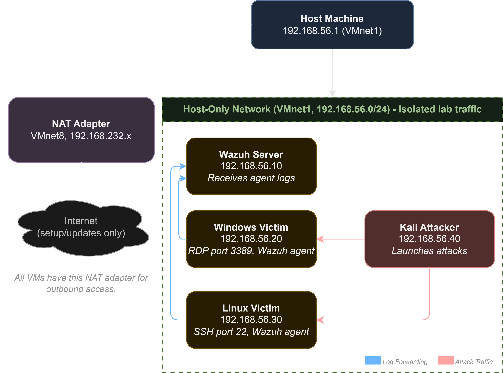

# Lab Architecture and Design Decisions

This document explains how the home SOC lab is structured and why the main design decisions were made. The aim is not
just to show how the lab was built, but also to make the reasoning behind it clear.

---

## Design Goals

Before choosing the tools and configuration, three goals shaped the design:

1. Realism over simplicity. The lab should reflect a small enterprise-style environment, with real operating systems,
   real attack tools, and a real SIEM deployment. Some shortcuts would make the setup easier, but they would also make
   the results less useful for learning and portfolio evidence.

2. Reproducibility. The steps should be clear enough that someone else, or a future version of me, could rebuild the
   environment from scratch. This also makes the project easier to troubleshoot and review later.

3. Portfolio legibility. The project should make sense to a technical hiring manager or SOC team lead without needing
   a long explanation. The documentation, diagrams, and reports are written with that kind of reader in mind.

---

## Why a Local Lab Instead of Cloud

My dissertation used a cloud-based cyber range with OpenStack, Kubernetes, Helm, and OpenTofu to provision environments dynamically. That type of infrastructure is useful for attack simulation at scale, but it is not ideal as a personal lab tool because it has a lot of overhead and is not fully production ready for that purpose.

This home lab has a different scope:

| Aspect | Cyber Range (Dissertation) | This Home Lab |
|---|---|---|
| Infrastructure | Cloud-native, orchestrated | Local VMs, static |
| Purpose | Attack simulation platform | Detection engineering |
| Orientation | Red team / attacker perspective | Blue team / defender perspective |
| MITRE usage | Map attack scenarios to techniques | Map detections to techniques |
| Complexity | Platform-level (managing the system that runs things) | Application-level (managing the things that run) |

The two projects support each other. The dissertation focuses more on building and running attack environments, while this lab focuses on detecting and investigating activity inside a controlled environment. Together, they show both attack and defence work at different layers of the stack.

Local virtualisation was chosen for this lab because:

- It gives full control over the environment without cloud costs
- Snapshots make it easy to reset VMs to a clean state
- Lab traffic stays contained within the host machine, reducing the risk of attack traffic reaching the real network
- VMware Workstation Pro is well documented, free for personal use, and similar to virtualisation tools used in
  enterprise environments

---

## Network Design

### The Core Problem to Solve

The virtual machines need to be able to:

1. Communicate with each other (attacker → victim, victim → SIEM)
2. Access the internet during setup for packages and updates
3. Stay isolated from the real network during attack simulations

One network adapter mode does not cover all three needs properly. The solution is to use two adapters per VM.

### Adapter 1: NAT (VMnet8)

NAT (Network Address Translation) gives each VM outbound internet access through the host machine. VMware Workstation
works as a virtual router and translates the VM's private IP address to the host's real IP address for outbound traffic.

- Each VM gets a private IP in the 192.168.232.x range automatically through VMware's internal DHCP
- The VM can reach the internet for package downloads and updates
- VMs using NAT cannot reach each other directly because each VM's NAT connection is isolated
- This adapter is mainly used during setup and can be disabled after configuration for full isolation

### Adapter 2: Host-Only (VMnet1)

VMware creates a virtual network interface on the host machine, visible in Windows as "VMware Network Adapter VMnet1". All VMs connected to VMnet1, along with the host machine, share a private subnet.

- Subnet: 192.168.56.0/24
- Each VM has a static IP on this subnet, listed in the table below
- Attack traffic, Wazuh agent communication, and SIEM logs all use this adapter
- This adapter has no route to the internet, so the traffic stays contained
- The host machine can reach each VM using its static IP, which is useful for opening the Wazuh dashboard in the host browser at https://192.168.56.10

### IP Address Allocation

| VM | Role                 | Host-Only IP |
|---|----------------------|---|
| Wazuh Server | SIEM manager + dashboard | 192.168.56.10 |
| Windows Victim | RDP target, Wazuh agent | 192.168.56.20 |
| Linux Victim | SSH, Wazuh agent     | 192.168.56.30 |
|Kali Attacker | Attack platform |192.168.56.40 |

Static IPs are assigned manually on each VM's internal network interface. This is intentional. In a real environment, servers normally need predictable addresses so agents and services know where to connect. If DHCP was used here, IP addresses could change after a reboot and break Wazuh agent registration.

### Why Not Bridged Networking?

Bridged mode makes a VM appear as a real device on the physical network. It gets an IP address from the home router's
DHCP server and can be reached by other devices on the same network.

I rejected bridged networking for this lab because:

- Attack traffic could be visible on, or affect, the real home network
- It provides less isolation and is harder to control
- It is not needed for this use case, because the lab only needs internal VM-to-VM communication

### Network Diagram

The diagram below shows the four virtual machines, their assigned roles, and the separation between the Host-Only and NAT networks.

The Host-Only network (`VMnet1`) carries internal lab traffic, including simulated attacks, Wazuh agent communication, and administrative access from the host. The NAT network (`VMnet8`) provides outbound internet access for software installation and updates.

---

## VM Selection Rationale

### Wazuh Server with Ubuntu 22.04 LTS

Ubuntu 22.04 LTS was chosen for the Wazuh server because:
- Wazuh officially supports and documents installation on Ubuntu 22.04
- The LTS release provides stable and well-maintained packages
- A minimal server install is enough because the VM runs headless and the Wazuh dashboard is accessed from the host
  browser
- 4GB RAM gives the Wazuh manager, indexer (OpenSearch), and dashboard enough headroom on the same VM

### Windows 10 Pro Victim

Windows is included because:
- RDP brute force (T1110) is a common attack technique in real-world incident data
- Windows event logs, including Security, System, and Application logs, are a key data source in enterprise SOC
  environments
- The Wazuh Windows agent can forward Windows Event Log entries directly to the SIEM
- It shows cross-platform detection alongside the Linux victim
- Windows 10 Pro is required for native RDP server support

The Windows VM has 4GB RAM so it can run without becoming too slow while generating real log activity.

### Linux Victim with Debian 12

Debian 12 was chosen for the Linux victim because:
- It shows that Wazuh detection rules can work across different Linux distributions, not only Ubuntu
- It gives a more realistic environment, because real networks rarely use one operating system everywhere
- SSH brute force through `/var/log/auth.log` works in the same way as Ubuntu
- The Wazuh agent installation process is the same as Ubuntu
- It has a lighter footprint than Ubuntu, so 2GB RAM is enough

### Kali Linux Attacker

Kali was chosen as the attacker machine because it is a standard penetration testing distribution and already
includes the tools needed for this lab.

It was selected because:
- Hydra, Nmap, Metasploit, and many other tools are pre-installed, so there is less manual setup
- The attack commands documented in the lab can be reproduced by anyone using a Kali VM
- It is familiar to security professionals and recognisable in a portfolio project
- It clearly separates the attacker role from the victim and defender roles at the operating system level
- A pre-built VMware image is available, so it can be imported without a full manual installation

The Kali VM has 4GB RAM to give Metasploit enough headroom for later scenarios.

---

## SIEM Selection: Wazuh over Splunk

Both Wazuh and Splunk would be valid choices for this type of lab. I chose Wazuh for the following reasons:

**No data ingestion cap.** Splunk's free tier limits ingestion to 500MB per day. During active attack simulations, that limit could be reached quickly. Wazuh does not have that restriction.

**Native MITRE ATT\&CK integration:** Wazuh maps its built-in rules to ATT\&CK techniques by default. The dashboard shows technique IDs alongside alerts, which directly supports the mapping work in `05-mitre-mapping/`.

**Agent-based architecture mirrors enterprise deployments:** Installing a Wazuh agent on each victim VM and sending logs to a central manager reflects how many enterprise SIEM deployments work. This is the model I wanted to practise.

**Open source with an active community:** Wazuh has detailed documentation, community support, and existing rule
sets. That reduces setup friction while still leaving enough technical work to learn from.

**No licensing complexity:** Wazuh is free for this use case and does not require trial periods, licence keys, or feature restrictions.

---

## Why MITRE ATT\&CK

MITRE ATT\&CK is the standard framework used to describe attacker behaviour. It is used by:
- SOC teams to tag and categorise alerts
- Threat intelligence reports to describe observed campaigns
- SIEM vendors such as Wazuh, Splunk, and Microsoft Sentinel to label built-in detection rules
- Hiring managers and interviewers when assessing whether someone understands real-world threats

ATT\&CK is **behaviour-based, not tool-based**. A technique such as T1110 (Brute Force) describes *what the attacker is doing*, not the exact tool they used. A detection rule mapped to T1110 should therefore detect the behaviour pattern, such as repeated authentication failures from one source, rather than only looking for a specific tool like Hydra, Medusa, Burp Suite, or a manual login attempt.

Using ATT\&CK in this lab also links back to my dissertation. The dissertation used ATT\&CK to map attack scenarios from the attacker perspective, while this lab uses the same framework to map detection coverage from the defender perspective.

---

## Snapshot Strategy

Snapshots are stored by VMware Workstation on the host disk. I use them at key points during the lab build and scenario setup so there is a safe state to return to if something fails.

---

## Relationship to the Dissertation Cyber Range

This lab does not replace the cyber range. It complements it.

| | Cyber Range | This Home Lab |
  |---|---|---|
| What it runs on | OpenStack / Kubernetes | VMware Workstation Pro |
| What it manages | Infrastructure provisioning | Application and log layer |
| Primary skill demonstrated | Cloud-native infrastructure engineering | Detection engineering and SOC analysis |
| MITRE ATT\&CK role | Map attack scenarios (red team) | Map detection coverage (blue team) |
| Portfolio narrative | "I built the platform" | "I detect what happens on the platform" |

Together, the two projects show both sides of offensive and defensive security while using the same framework to keep the work connected.
